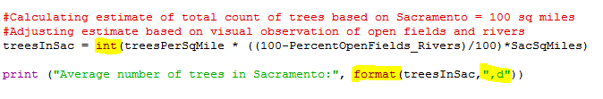
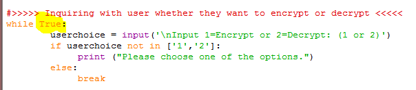
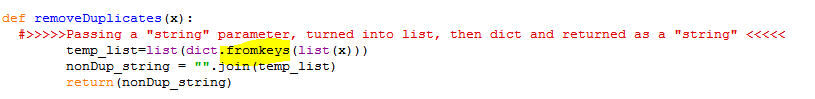
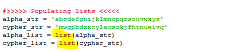
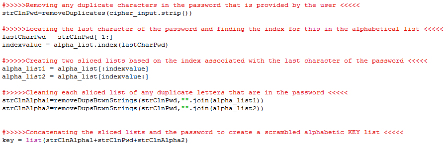
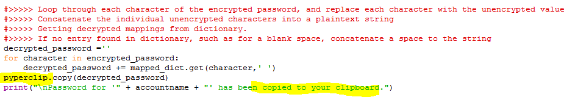
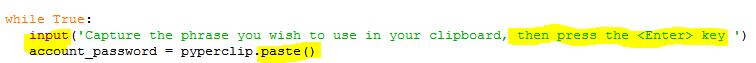
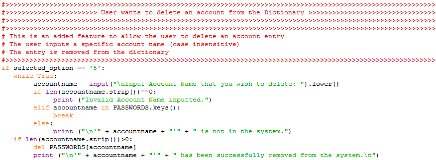

# Unit 1 - Reflections: Programming in Python
### [Return to Angie Home](https://angie-gh.github.io/adix.github.io/)

*********************************************************************************** 

### Purpose of this page:
We have completed half of a semester in Python Programming and are reflecting on the scripting basics that we have just learned.  The below comments are specific to me.

### Overall reaction to Python computing:
I find Python to be an incredibly forgiving scripting language. I have scripted in other formats such as: batch, bash, lotuscript, and javascript(with ajax), but the Python environment allows for a faster learning curve and minimal lines of code.    

### Ah-ha Moments:
**Below are some of my observations:**
- #### The colon is your friend
	With any kind of loop declaration or function definition, a colon (:) is needed to indicate that some decision making logic is about to follow.  As a Python coder, remember you need to add a colon for these scenarios.  Note:  When the py source code is compiled, the runtime complier will let you know if an expected colon is missing.
- #### Semi-colons at the end of sentences are overrated
	If you have ever coded in C#, you will be thrilled to know that in Python scripting, a semi-colon is not used at the end of a line.  It is like having Christmas all year long.  No need to search for missing semi-colons in your code.
- #### Indents are sensitive
	*Don't panic when you get a compile error.  50% of the time it is an extra space after an indentation.*
	Although the single spaces can seem petty, visually it makes the code dependably easy to read.
- #### Numeric commas can't be taken for granted
	In many languages, the coder can often take for granted that the comma (,) in numeric values will automatically be displayed.  In Python, an additional formating command format(numeric_value,",d") needs to be included:
	 **Example:**
	 print (format(42500, ",d"))
	  **Screenshot example:**
	 
- #### "While True" is a nice automatic loop
	When needing to generate a quick error-handling loop, it is nice and simple to use a "While True" loop and then only exit by performing a "break" statement. 
	 **Screenshot example:**
	 
- #### Built-In modules/features are timesavers
	There is the ability to use the Dictionary datatype to strip out duplicate entries in a string.
	 Screenshot example:
	 
- #### Quickly changing lists into strings and vice versa
	One of the biggest timesavers so far has been learning how to quickly translate a list into a string and vice versa.
	 Examples:
	 "".join(x)   turns a list "x" into a string
	 list(x)      turns a string "x" into a list
	 x.split      turns a string "x" into a list
	 **Screenshot example 1:**
	 
	 **Screenshot example 2:**
	 

### Useful modules to import into code:
- #### random module
	The "random" module allows the coder to generate random output with a single line of code.  
	 **Example Code: A game that users the random module:**
	 [Rock, Paper Scissors Game](https://github.com/Angie-gh/unit1/blob/master/week03_RockPaperScissors_Angie.py)
- #### getpass module
	The "getpass" module is a super valuable module for quickly blocking the display of a user's keystrokes when they are inputting sensitive information like a password.  
	 **Example Code: A password encryption tool that uses the getpass module:**
	 [Encrypting and Decrypting Passwords](https://github.com/Angie-gh/unit1/blob/master/week05_EncryptionProject_Angie_ExtraCredit_Part7_Part8_b.py)
- #### pyperclip module
	This is one of my favorite modules.  The "pyperclip" module can retrieve input or place output via the user's clipboard.  This provides a level of security by protecting unencrypted text. If a third party is shoulder surfing the user of a python program, the observer won't have privy to whatever sensitive data is being sent or returned to the user.  Ideally, the user would paste their output
into a protected input text field, so that the text would never be visible, or minimally hidden with asterisks.
	 **Screenshot example 1 - outputing content from program to clipboard:**
	 
	 **Screenshot example 2 - retrieving input for program from clipbard:**
	 	
	
- #### time module
	The concept of pausing is extremely important, especially when a python program is running from the command line.  The "time" module allows the coder to pause (sleep) for a specified amount of seconds. This allows a program to show the results for a specified amount of time before the screen disappears.  It adds to a level of security because the program doesn't have to wait for the user to provide any input before shutting down.
	 

### How my programs differ from other coders:
**Part A:**
 I take pride in making sure that my code is commented well.  I think it is disrespectful to not comment code if others are expected to support your original logic. 
 **Example of Commenting:**
 
 **Part B:**
 I try to return the user to a menu or a "Continue Y/N" prompt so that the program doesn't shutdown unnecessarily.  No matter the size of the application, there is no reason to not make the experience user-friendly. 
 **Example Code: A Password Locker tool that utilizes both a menu and a continue prompt:**
 [Menu driven Password Locker](https://github.com/Angie-gh/unit1/blob/master/week06_pw_Angie.py)

### The program that I am the most proud of:
I am most proud of solutions that use minimal lines of code to accomplish something that would otherwise be exptremely time-consuming. Employing well-named functions helps to make repetitive code easier to follow.
 **Example Code: A encryption and decryption tool that is efficient in its use of logic:**
 [Encrypting and Decrypting Passwords](https://github.com/Angie-gh/unit1/blob/master/week05_EncryptionProject_Angie_ExtraCredit_Part7_Part8_b.py)

### Are these programs a reflection of my abilities?:
I take pride in the programs that I've written thus far.  Based on what we've learned in this first half of the semester, I've implemented solutions using the most efficient Python tools.  Once I learn more techniques, I will be able to provide solutions that are far more complex than what we have currently tackled. :)  

### Sample Programs
- [Password Generator](https://github.com/Angie-gh/unit1/blob/master/week03_password_generatorAngie.py)
- [Rock, Paper Scissors Game](https://github.com/Angie-gh/unit1/blob/master/week03_RockPaperScissors_Angie.py)
- [Encrypting and Decrypting Passwords](https://github.com/Angie-gh/unit1/blob/master/week05_EncryptionProject_Angie_ExtraCredit_Part7_Part8_b.py)
- [Menu driven Password Locker](https://github.com/Angie-gh/unit1/blob/master/week06_pw_Angie.py)
 

*********************************************************************************** 

### [Return to Angie Home](https://angie-gh.github.io/adix.github.io/)
